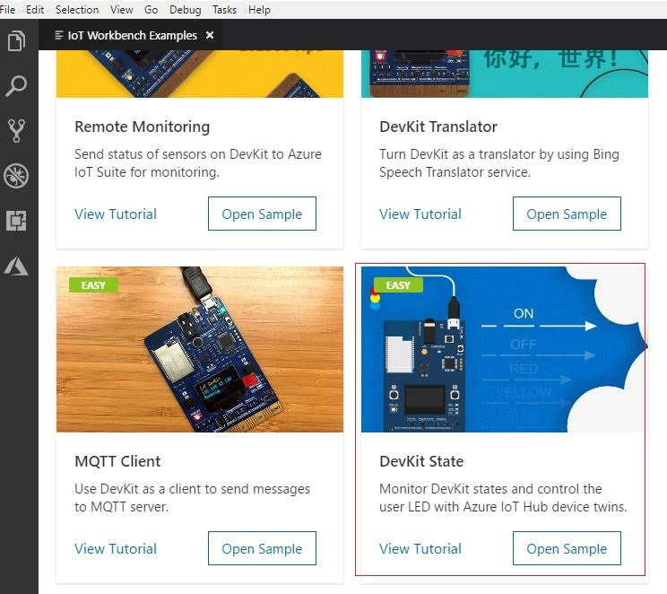
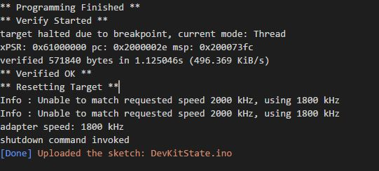
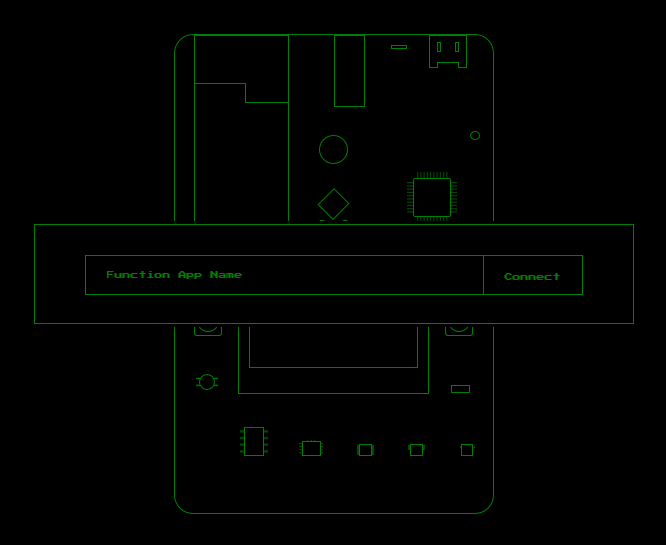
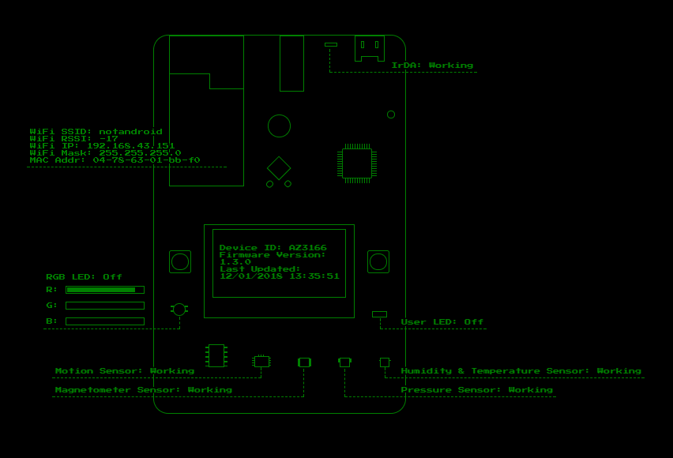

## DevKit State

In this tutorial, you can monitor the MXChip IoT DevKit WiFi information and sensor states and control the color of the user LED using Azure IoT Hub device twins.

## About IoT DevKit

The [MXChip IoT DevKit](https://aka.ms/iot-devkit) (a.k.a. IoT DevKit) is an all-in-one Arduino compatible board with rich peripherals and sensors. You can develop for it using [Azure IoT Device Workbench ](https://aka.ms/azure-iot-workbench). And it comes with a growing [projects catalog](https://aka.ms/devkit/project-catalog) to guide you prototype Internet of Things (IoT) solutions that take advantage of Microsoft Azure services.

## What you need

Finish the [Getting Started Guide](https://docs.microsoft.com/en-us/samples/azure-samples/mxchip-iot-devkit-get-started/mxchip-iot-devkit-get-started/) to:

- Have your DevKit connected to Wi-Fi.
- Prepare the development environment.

An active Azure subscription. If you do not have one, you can register via one of these two methods:

- Activate a [free 30-day trial Microsoft Azure account](https://azure.microsoft.com/free/).
- Claim your [Azure credit](https://azure.microsoft.com/pricing/member-offers/msdn-benefits-details/) if you are MSDN or Visual Studio subscriber.


## Open the project folder

### Start VS Code

- Start Visual Studio Code.
- Make sure [Azure IoT Device Workbench](https://marketplace.visualstudio.com/items?itemName=vsciot-vscode.vscode-iot-workbench) is installed.
- Connect IoT DevKit to your PC.

### Open Azure IoT Device Workbench Examples

Use `F1` or `Ctrl+Shift+P` (macOS: `Cmd+Shift+P`) to open the command palette, type **Azure IoT Device Workbench**, and then select **Open Examples...**.


Select **IoT DevKit**.


Then the **IoT Device Workbench Example** window is shown up.


Find **DevKit State** and click **Open Sample** button. A new VS Code window with a project folder in it opens.



A popup will show asking to restore packages. Click **Restore** to restore the NuGet packages for the Azure Functions app.


## Provision Azure Services

In the solution window, open the command palette and select **Azure IoT Device Workbench: Provision Azure Services...**.


Then VS Code guides you through provisioning the required Azure services.


The whole process includes:

- Select an existing IoT Hub or create a new IoT Hub.
- Select an existing IoT Hub device or create a new IoT Hub device.
- Create a new Function App.

Please take a note of the Function App name and IoT Hub device name you created. It will be used in the next section.

## Modify code for Azure Functions

Open **Functions\State.cs** and modify the following line with the device name you provisioned in previous step:

```cpp
static readonly string deviceName = "";
```

## Deploy Azure Functions

Open the command palette and select **IoT Device Workbench: Deploy to Azure...**.


## Config IoT Hub Device Connection String

1. Switch the IoT DevKit into **Configuration mode**. To do so:

   - Hold down button **A**.
   - Push and release the **Reset** button.

2. The screen displays the DevKit ID and 'Configuration'.

   

3. Open the command palette and select **Azure IoT Device Workbench: Configure Device Settings...**.

  

4. Select **Config Device Connection string**.

5. Then select **Select IoT Hub Device Connection String**.

   

6. Select **Select IoT Hub Device Connection String**.

   

   This sets the connection string that is retrieved from the `Provision Azure service` step.

7. Click **OK** on the popup to confirm the device is in Configuration mode.

   

8. The configuration success notification popup bottom right corner once it's done.

   

## Build and upload the device code

1. Open the command palette and select **IoT Device Workbench:Upload Device Code**.

   

2. VS Code then starts verifying and uploading the code to your DevKit.

   

3. The IoT DevKit reboots and starts running the code.

## Monitor DevKit State in Browser

1. Open `<Path to project>\web\index.html` in browser.
2. Input the Function App name you write down.
3. Click connect button.
4. You should see DevKit state in a few seconds.



## Control DevKit User LED

1. Click User LED or RGB LED on the web page
2. You should see the state of the leds changed in few seconds
